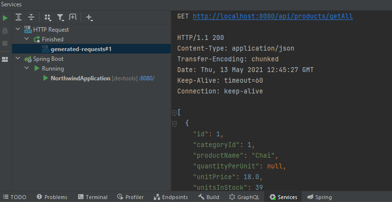

<h1 align="center">

 
 

Spring Boot ile Northwind Backend Uygulaması
</h1>

### Projenin Hazırlanması ve Çalıştırılması

1. Projeyi cihazınıza indirin: `git clone https://github.com/ugurcandede/Spring-Boot-Northwind`
2. Projeyi `IntelliJ IDEA` veya `Eclipse` gibi bir editörle açın.
3. PostgreSQL'i indirin ve `Northwind` adında veritabanı oluşturun.
4. `postgre_db.sql` dosyasını PostgreSQL içinde oluşturduğunuz veritabanı içine aktarın.
5. `src/main/resources/application.properties` dosyası içindeki
    - `spring.datasource.url`
    - `spring.datasource.username`
    - `spring.datasource.password` alanlarını uygun şekilde doldurun.

### Veritabanı UML diagramı ve API Isteği

 

## Lisans

Proje MIT Lisansına Sahiptir, Copyright (c) 2021 Ugurcan Dede.
